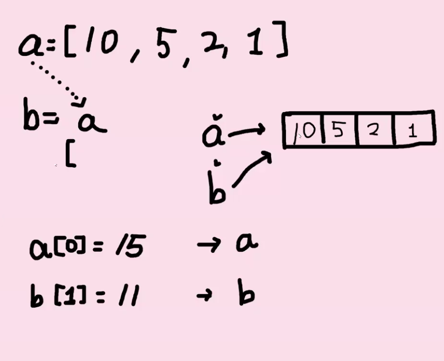

### 1. built in 함수

```
abs()
sum()
len()
ord()
chr()
max()
min()
```


### 2. 정중앙 문자 

```python
def get_middle_char(a):
    #return할 리스트 생성
    mid_list = [] # None
    print(type(mid_list)) # list
    print(type(a[1])) # str
    
    # 글자 개수를 2로 나눈 몫을 인덱스로 가지는 글자를 빼내야 함
    idx=len(a)//2
    # idx = 2    
    if len(a) % 2 : #홀수일 경우 
        mid_list = a[idx] # a[2]
        return mid_list    
   
    else:
        ## list는 더하기가 안되는데 mid_list의 값이 none이라 된다?
        mid_list = a[idx-1]+a[idx] ## 실수 : a는 list가 아니라 str이다.
        # mid_list는 list였는데 str을 넣었더니 str이 됐다. 
        return mid_list

print(get_middle_char('songyun'))
print(get_middle_char('coding'))


## 총장님 코드 
def get_middle_char(a):
    return a[(len(a)-1)//2 : len(a)//2+1]

print(get_middle_char('songyun'))  print(get_middle_char('coding')) 
```


#### 3.

```
(1)
가능하다. 함수 쪽에 보면 name은 위치 인자 location='서울' 로 키워드 인자로 되어 있으므로 
'허준'은 name에 할당된다. 

(2) 
가능하다. 두 arguments가 키워드 인자이므로 name에는 철수, location에는 대전으로 함수에 들어감

(3)
가능. 영희는 위치 인자이므로 자동으로 name에 들어가게 되고 , location은 키워드 인자로 광주

(4) 
불가능하다. 키워드 인자뒤에는 위치 인자가 올 수 없다.  
name='길동' 으로 되지만, 위치인자와 키워드 인자는 함께 할 수 없다. 
```


#### 4. 

None

```python
keyward(키워드) 인자를 선언한 뒤에는 position(위치) 인자를 선언할 수 없다.
def my_func(a,b):
    c = a + b
    print(c)
    return c

result = my_func(3, 7)

print(result)


# return 값을 입력해주지 않았기 때문에 result는 결과적으로 아무것도 입력되지 않았다. 다만 my_func 함수 안에서 a + b를 출력해준 것이다.
```


#### 5. 재귀함수

- 회문판별

```python
## 재귀함수 활용
def is_pal_recursive(arg):
     i=0
     # 재귀가 끝나는 시점 설정
    if len(arg) <=1:
        return True
     # 입구컷 기능
    if arg[i]!=arg[-i-1]:
        return False
    # 재귀가 되는 조건 설정, 앞 뒤로 잘라내는 slicing 활용
    else:
        i+=1
        arg = arg[i:len(arg)-i]
        return is_pal_recursive(arg)
 
## for문 활용
def is_pal_while(arg):
    
    for i in range(len(arg)//2):
        if arg[i]==arg[-i-1]:
            continue
        else:
            return False
    return True
    
print(is_pal_recursive('tomato')) 
print(is_pal_recursive('racecar'))
print(is_pal_recursive('azza'))
```


#### 6. any함수 구현

- any()는 요소 중 하나라도 참이면 True, 비어있으면 False를 반환

  ```python
  def my_any(elements):
      
      for element in elements:
          if element == []: # 공백은 for안에 못들어간다.
              continue
          elif bool(element) == True:
                  return True
          else:
              return False
      
      return False
  
  print(my_any([0, 4, 6, '8']))
  print(my_any([[], 3, 8, '5']))
  print(my_any([]))
  print(any([5, 1, 3, '4']), any([[], 2, 4, '1']), any([]))
  ```

  

  

  # 오늘 배운 것 

  #### global 함수 사용

  ```python
  a=10 ## global 변수 
  def func1():
      global a ## 다음 a를 global 변수로 쓰겠다.
      a = 3
  
  print(a)  ## 10
  func1() 
  print(a)  ## 3
  	
  ```

  #### global 함수 에러  (다시 보기)

  ```python
  ## syntax error
  a = 10
  def func1():
      print(a) ## 이 부분 까진 에러가 없었지만  	
      global a ## 변수 a가 global선언 전에 사용 됐기 때문에 에러 발생
      a = 3
      
  
  print(a)
  func1()
  print(a)
  ```

  ```python
  # 의문점
  a = 10
  ## a가 global 변수이면서 함수의 parameter일 수는 없나?  
  
  def func1(a): # a는 이미 a=10이라고 선언했기 때문에 global 에서 오류가 생김
      global a  # 
      a = 3
      
  print(a) #10
  func1(3)
  print(a)
  
  ## syntaxEroor: name 'a' is parameter and global
  ```

  #### locals()를 이용해 함수 안의 변수를 dictionary로 묶기

  ```python
  a_var = range(2)
  def locals_test():
      b_var = 3
      c_var = 'hi'
      d_var = locals() ## locals가 선언된 함수내의(local)변수들을 dict으로 묶음
      print(d_var) ## 출력: {'b_var': 3, 'c_var' : 'hi'}
  
  locals_test()
  ```

  #### map 활용

  ```python
  # input값들을 바로 숫자로 사용하고 싶은 경우
  # 외우기
  n,m = map(int, input().split())
  ```

  #### filter(fucntion, iterable)

  ```python
  def odd(n):
      return n % 2
  numbers = [1,2,3]
  result = filter(odd, numbers) ## odd란 함수에 numbers를 넣고, True인 인자들을 result에 넣겠다.
  print(result, type(result)) ## <filter object at 0x10e4dfc10> <class filter>
  list(result) ## result는 위와 같이 출력되므로 list로 형변환 해야 한다. 
  ```

  #### lamda[parameter] : 간결하게 함수 이용하기

  ```python
  triangle_area = lambda b,h : 0.5*b*h ## 괄호 없이 arguments를 적은 다음 인자를 어떻게 활용할지 
  triangle_area(5,6)
  ```

  

  #### sort (숫자 정렬)

  ```python
  a = numbers.sort() ## (reverse = True) 내림차순
  
  numbers.sort() # 괄호안에 reverse=True 하면 역순으로 나온다.
  print(numbers) # 괄호안에 numbers.sort()이면 반환하는 값이 None이다. 
  
  lst = sorted(numbers) # sorted(list) 반환값이 정렬된 리스트이다. / reverse=True 하면 역순으로 나온다.
  print(lst)
  
  ```

  #### dictionary함수에 대해

  ```python
  a['key'] = ['value1', 'value2']
  ```

  ```python
  a=[ [0,1,2],[3,4,5],[6,7,8]]
  
  def draw(lst):
      result = ''
      for i in a :
          result += f"{i}\n"
      return result
  print(draw(a))
  ```

  ​	


# 0125 TIL	

a=3
b=a

a ->3  <- b

```python
a=[10,5,2,1] 
여기서 a는 4칸 짜리 리스트를 가리키고 있다. 

(1) 함께 바뀜
b=a # 이렇게 되면 b도 a와 같은 리스트를 바라보고 있다. 
a[0] =15
b[1] =11 # 이렇게 바꾸면 a,b둘다 같은 리스트를 바라봄으로 >>> [15,11,2,1] 로 바뀐다.

(2) 따로 바뀜 (shallow copy)
b=a[:] # 이렇게 할당을 하면 a 리스트의 사진을 찍고 그 사진을 b에 넣겠다는 뜻. 둘은 다른 list
a[0] =15 # 결과 [15,5,2,1]
b[1] =11 # 결과 [10,11,2,1]


```




## 0125 practice 공부

1. 학생들의 과목별 점수 합계 

```python
## 학생의 과목별 점수이다. 세 학생의 과목별 점수 합을 구하라. 
## 의문: 이게 최선인가?

students = [
 [100, 80, 100, 90, 56],
 [90, 90, 60, 65, 50],
 [80, 80, 80, 54, 35]
]

result = 0 
for i in range(len(students[0])): # 첫번째 for문은 과목의 갯수만큼
    for j in range(len(students)): # 두번째 for문은 학생의 수만큼
        result+=students[j][i]    
    print(result)
    result=0
    
>>> 270
250
240
209
165 
```


# 0129 TIL	

## 데이터 구조 

#### 문자열(String)  

: 변경할 수 없고(immutable), 순서가 있고(ordered), 순회 가능한(iterable)

- 조회/탐색

  .find(x) : x의 첫 번째 위치를 반환합니다. 만일 리스트 내에 x가 없으면, -1을 반환합니다.

  .index(x): x의 **첫 번째 위치**를 반환합니다. 만일 x가 리스트 내에 없으면, 오류가 발생합니다.

  .startswith(x): 문자열이 x로 시작하면 True를 반환하고 아니면 False를 반환합니다.

  .endswith(x): 문자열이 x로 끝나면 True를 반환하고 아니면 False를 반환합니다.

  ```python
  a = 'apple' 
  a.find('p') # >>> 1, 찾는게 없으면 -1 반환
  a.index('p') # >>> 1 위치를 반환, 찾는게 없으면 오류 발생
  
  a = 'hello python'
  a.startswith('hello') # >>> True
  ```

- 문자열 변경

  .replace(old, new, count) :바꿀 대상 글자를 새로운 글자로 바꿔서 반환합니다. count를 지정하면 해당 갯수만큼만 시행합니다.

  .strip([chars]) : 특정한 문자들을 지정하면, 양쪽을 제거하거나(`strip`) 왼쪽을 제거하거나(`lstrip`), 오른쪽을 제거합니다(`rstrip`).

  **.split([chars])**: 문자열을 특정한 단위로 나누어 리스트로 반환합니다.

  ***'separator'*.join(iterable)**  : iterable의 문자열들을 separator로 이어붙인 결과를 반환 

  ```python
  a = 'yaya!'
  b = 'wooooowoo'
  a.replace('y','h')  # haha , ('y','h',1) 하면 haya 출력
  a.strip([chars])
  
  a = '   hello!  \n'
  b = 'hihihihahahahihi'
  c = 'monty python'
  a.strip(' ') # 'hello!  \n'
  b.rstrip('hi') # 'hihihihahaha'
  c.rstrip(' python') # m , 오른쪽에서부터 공백포함해서 p,y,t,h,o,n 글자를 다 지우겠다.
  
  a = 'a_b_c'
  a.split('_')  # ['a', 'b', 'c'], '_' 기준으로 a,b,c를 각각 리스트로 반환하겠다.
  
  word = '배고파'
  words = ['안녕', 'hello']
  '!'.join(word) # >>> '배!고!파' 
  ''.join(words) # >>> '안녕hello' , 이렇게 list안의 두 idx를 이어붙일 수 ㅇㅅ다. 
  ```


### 리스트(List)

- 값 추가 및 삭제

.append(x) : x그대로 리스트에 추가 

.extend(x) : x (iterable) 항목을 추가

.remove(x) : 리스트에서 **값이 x인 첫번째 항목**을 삭제합니다. 항목이 없으면 `ValueError`가 발생합니다.

.pop(i) : 위치 i에 있는 값을 삭제하며, **그 항목을 반환**. i가 지정되지 않으면 마지막항목을 삭제하고 반환. 

```python
cafe = ['starbucks', 'tomntoms', 'hollys']
cafe.append(['banana']) # [] 형태로 추가 
cafe.extend(['banana']) # iterable을 추가 
>>> ['starbucks', 'tomntoms', 'hollys', ['banana'], 'banana']

numbers = [1, 2, 3, 4, 5, 6]
numbers.remove(2) #>>> [1,3,4,5,6]
numbers.pop(0) # >>> 1 # 원본을 수정하고, 없앤 항목을 반환
numbers # >>> [2,3,4,5,6] # 수정된 원본

```


### 딕셔너리(ditionary)

- 조회

.get(key, default) : key를 통해 value를 가져옵니다. key가 존재하지 않을 경우 None또는 설정한 default 값을 반환합니다

```python
my_dict = {'apple': '사과', 'banana': '바나나', 'melon': '멜론'}
print(my_dict.get('pineapple', '파인애플' )) >>> 파인애플
```


## 메소드 정리 

- 인스턴스 메소드 
  - self 매개변수를 통해 동일한 객체에 정의된 속성 및 다른 메소드에 자유롭게 접근 가능
  - 클래스 자체에도 접근 가능 -> **인스턴스 메소드가 클래스 상태를 수정**할 수도 있음. 
- 클래스 메소드 (@classmethod)
  - 클래스를 가리키는 **cls 매개변수**를 받음 
- 스태틱 메소드 (@staticmethod)
  - 임의의 매개변수를 받을 수 있지만, self 매개변수 사용 x
  - 클래스의 이름공간에 귀속됨. 주로 해당 클래스로 한정하는 용도로 사용
  - 객체 상태나 클래스 상태를 수정할 수 없음.  (??)

## 객체지향의 핵심 4가지 

- 추상화 
- 상속
- 다형성
- 캡슐화


#### super() 활용. 

```python
class Person:
    def __init__(self, name, age, number, email):
        self.name = name
        self.age = age
        self.number = number
        self.email = email 
        
    def greeting(self):
        print(f'안녕, {self.name}')
      
    
class Student(Person):
    def __init__(self, name, age, number, email, student_id): # 받아올 모든 변수
        super().__init__(name, age, number, email) # 부모 class와 중복되는 것들
        self.student_id = student_id # 부모 class에 없는 변수
        
p1 = Person('홍교수', 200, '0101231234', 'hong@gildong')
s1 = Student('학생', 20, '12312312', 'student@naver.com', '190000')
```


# 0202 TIL (에러와 예외)

### Syntax Error (문법 에러)

- EOL (End of Line)
- EOF (End of File)

### Error 종류

1. ZeroDivisionError : 0으로 나누고자 할 때 발생
2. NameError : namespace 상에 이름이 없는 경우

3. TypeError 

```python
# Type 불일치
1+'1'
round('3.5')

#argument 누락 및 개수 초과
divmod() , divmod(1,2,3)
import random
random.sample()
```

4. ValueError

```python
#타입은 올바르나 값이 적절하지 않거나 없는 경우
int('3,5')
range(3).index(6)
```

5. IndexError : 인덱스가 존재하지 않거나 범위를 벗어나는 경우

```python
empty_list = []
empty_list[2]
```

6. KeyError : 해당 키가 존재하지 않는 경우
7. ModuleNotFoundError : 존재하지 않는 모듈을 import 하는 경우 
8. ImprotError - Module은 있으나 존재하지 않는 클래스/함수를 가져오는 경우 

```python
# 오류
from random import sampl

# 정상
from random import sample
sample(range(3), 1) # [1,2,3] 3개의 sample 중 1개 뽑기
```

9. IndentationalError - 들여쓰기 에러


### Exception (예외)

- 실행 도중 예상치 못한 상황을 맞이하면, 프로그램 실행을 멈춤

- 예외는 여러 type으로 나타나고, type이 메시지의 일부로 출력됨
- 모든 내장 예외는 Exception Class를 상속받아 이뤄짐


#### - 예외처리

try 문 / except 절을 이용하여 예외 처리 가능

-  try문
   - 오류가 발생할 가능성이 있는 코드를 실행
   - 예외가 발생되지 않으면, except 없이 실행 종료 

-  except 문
   - 예외가 발생하면 except 절이 실행
   - 예외 상황을 처리하는 코드를 받아서 적절한 조치를 취함.

```python
try:
    numbers = [1,2,3]
    number = numbers[4] # 없는 index이므로 IndexError 발생
except IndexError:
    print('오류 발생')
else: # Error가 발생하지 않은 경우 수행되는 문장
    print(number*100)
```


- finally 
  - 반드시 수행해야 하는 문장은 `finally`를 활용
  - 즉, 모든 상황에 실행되어야만 하는 코드를 정의하는데 활용
  - 예외의 발생 여부와 관계없이 `try`문을 떠날 때 항상 실행

```python
try:
    print('성적 파일을 읽어옵니다.')
    data = {'python': 'A+'}
    data['java']
except KeyError as err:
    print(f'{err}는 딕셔너리에 없는 키입니다.')
finally:
    print('성적 파일을 종료합니다.')
```


#### - 에러 메시지 처리

```python
try:
    empty_list = []
    print(empty_list[-1])
except IndexError as IdxErr:
    print(f'{IdxErr} 발생') # => list index out of range 발생
```


#### - 예외 발생 시키기(`raise`)

```python
raise ValueError('hi')
```


# 0205 TIL (HTML,CSS)

## HTML 기본 구조 

- html: 문서의 최상위 요소
- head: 문서 메타데이터 요소 
  - 문서 제목, 인코딩, 스타일, 외부 파일 로딩 등
  - 일반적으로 브라우저에 나타나지 않는 내용
- body: 문서 본문 요소
  - 실제 화면 구성과 관련된 내용


## head 예시

- `<title>`:브라우저 상단 타이틀
- `<meta>`: 문서 레벨 메타데이터 요소 
- `<link>`: 외부 리소스 연결 요소(CSS 파일, favicon 등)
- `<script>`: 스크립트 요소 (JavaScript)


## 요소(element)

- HTML 요소는 시작 태그와 종료 태그 그리고 태그 사이에 위치한 내용으로 구성
  - 태그(Element, 요소)는 컨텐츠(내용)를 감싸는 것으로 그 정보의 성격과 의미를 정의
- 내용이 없는 태그들
  - br, hr, img, input, link, meta 
- 요소는 중첩(nested)될 수 있음


## 시맨틱 태그 

- Non semantic 요소는 div, span 등이 있으며 h1, table 태그들도 시맨틱 태그 
- 의미 있는 정보의 그룹을 태그로 표현 


## form

- `<form>`은 정보(데이터)를 서버에 제출하기 위한 영역
- `<form>`기본 속성
  - action : form을 처리할 서버의 URL
  - method : form을 제출할 때 사용할 HTTP 메서드 (GET 혹은 POST)
  - enctype : method가 post인 경우 데이터의 유형


## input

- 다양한 타입을 가지는 입력 데이터 유형과 위젯 제공
- `<input>` 대표적인 속성
  - name : form control에 적용되는 이름 
  - value : form control에 적용되는 값
  - required, readonly, autofocus, autocomplete, disabled


clearfix :: after 다시 보기 

class에 속성을 부여할 때 부모에게 한번에 부여할지, 각 자식에게 속성을 각각 똑같이 부여할지 고민될때는 어떻게 해야하나요? 결과가 가끔 다르게 나올때가 있어서요 ㅠㅠ

___


# 0207

## 강의중

CSS Flexible Box Layout

1차원 레이아웃 모델 

축과 구성요소 별표 


flex-direction : row

Flex container (부모요소)를 쓸 때는 display: flex를 써야 함. 


# Bootstrap

스크립트 파일은 일반적으로body 닫는 태그 위에


### **CDN**

### 

## spacing

- mt-1 (margin top), (0.25rem = 4px)

```html
.mt{
margin-top: 0.25rem !important;
}
 # improtant는 덮어씌워지는걸 방지하기 위해
```

- mx-0 (margin x축)

```html
.mx-0 {
margin-right:0
margin-left:0
}
```

- py-0 () (padding)

```

```


